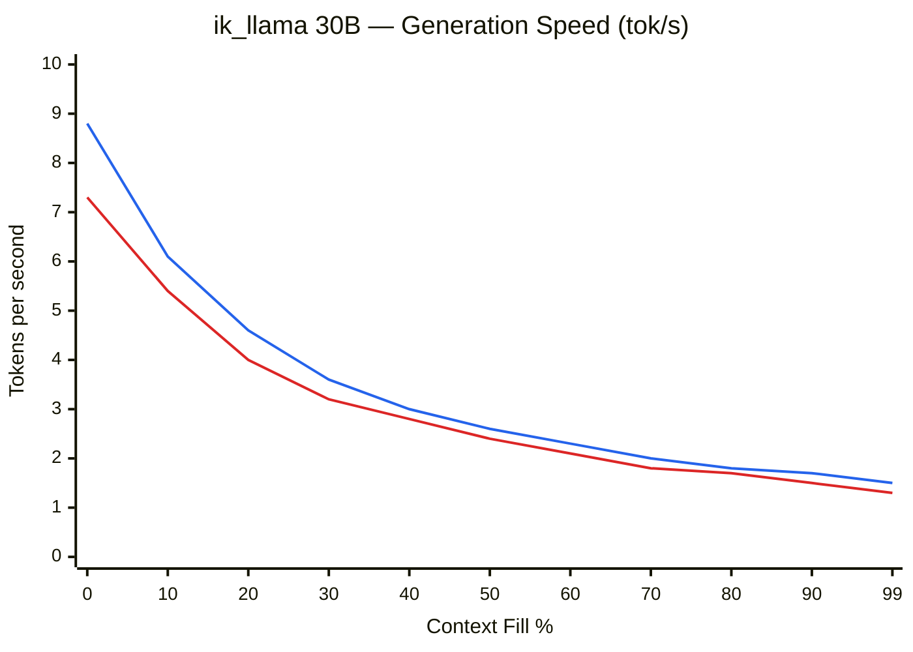
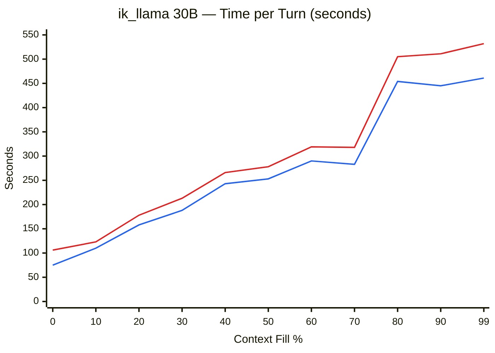
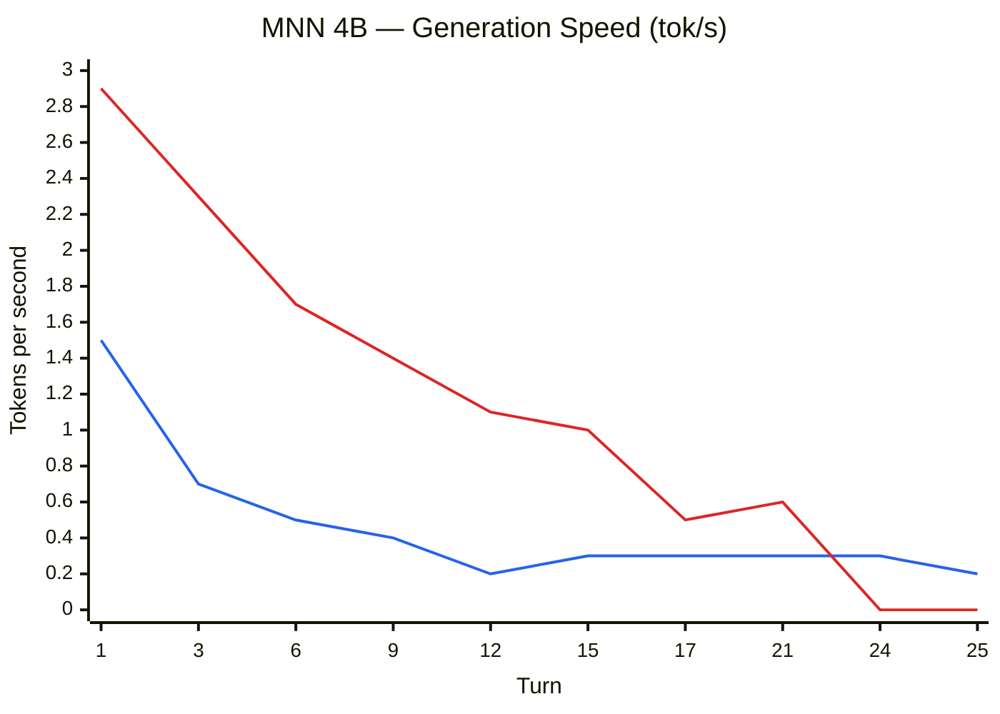
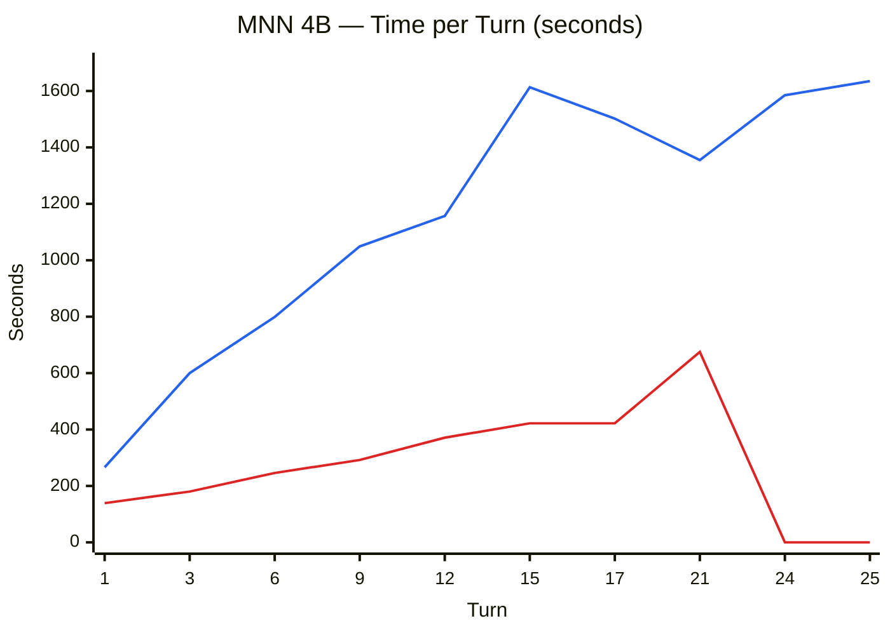

# Context Window Benchmark Results

Multi-turn context window characterization on Raspberry Pi 5. Refs #168, #24.

### Hardware

| | Pi 5 16 GB | Pi 5 8 GB + SSD |
|---|-----------|---------------|
| Hostname | `potato.local` | `ssd.local` |
| RAM | 16,218 MiB | 8,062 MiB |
| Storage | 128 GB SD card | 128 GB NVMe SSD |
| Swap | 2 GB zram (zstd) | 2 GB zram (zstd) |

---

## ik_llama — Qwen3-30B-A3B @ 48K

| Parameter | Value |
|-----------|-------|
| Model | `Qwen3-30B-A3B-Instruct-2507-Q3_K_S-2.66bpw.gguf` (9.5 GB) |
| Runtime | ik_llama.cpp (Pi 5 optimized build) |
| Context window | 49,152 tokens (48K) |
| KV cache | q8_0 / q8_0 — 2,448 MiB total (1,224 MiB K + 1,224 MiB V) |
| Flash attention | on |
| Cache RAM | 1,024 MiB (prompt cache in host RAM) |
| Parallel slots | 1 |
| Threads | 4 (all Pi 5 cores) |
| Sampling | temperature=0, seed=42, max_tokens=1024, cache_prompt=true |
| Conversation | Multi-turn storytelling, ~100 tok user / ~700 tok assistant per turn |
| Date | 2026-03-26 |

### Results Summary

Both hardware configurations filled the 48K context window to 99.4% (48,846/49,152 tokens) before context shift at turn 71.

| Metric | Pi 5 16 GB | Pi 5 8 GB + SSD |
|--------|-----------|-----------------|
| Turns completed | 71 | 71 |
| Total runtime | 5h 22m | 5h 58m |
| Max context fill | 99.4% | 99.4% |
| Gen speed (empty) | 8.8 t/s | 7.3 t/s |
| Gen speed (full) | 1.5 t/s | 1.3 t/s |
| Speed degradation | -83% | -82% |
| Swap usage | None | 2 GB zram (peaked at 2,047 MB) |

### Generation Speed vs Context Fill

> Blue: Pi 5 16 GB — Red: Pi 5 8 GB + SSD

### Time per Turn vs Context Fill

> Blue: Pi 5 16 GB — Red: Pi 5 8 GB + SSD

### Detailed Data

#### Pi 5 16 GB

| Turn | Fill % | n_past | Gen t/s | PP t/s | TTFT | Total | RSS | Avail | Temp |
|------|--------|--------|---------|--------|------|-------|-----|-------|------|
| 1 | 1.5% | 728 | 8.8 | 29.1 | 3.4s | 75s | 12,254 MB | 13,038 MB | 61°C |
| 9 | 13.0% | 6,379 | 5.6 | 11.7 | 3.2s | 102s | 12,269 MB | 13,030 MB | 63°C |
| 18 | 25.9% | 12,729 | 4.0 | 7.7 | 4.3s | 187s | 12,282 MB | 12,997 MB | 60°C |
| 27 | 38.5% | 18,913 | 3.1 | 5.9 | 5.8s | 215s | 12,291 MB | 12,998 MB | 60°C |
| 36 | 51.3% | 25,197 | 2.6 | 4.6 | 7.3s | 325s | 12,305 MB | 12,992 MB | 59°C |
| 44 | 62.3% | 30,645 | 2.2 | 4.4 | 15.1s | 334s | 12,314 MB | 12,932 MB | 59°C |
| 53 | 75.0% | 36,877 | 1.9 | 3.1 | 11.2s | 302s | 12,326 MB | 12,957 MB | 60°C |
| 62 | 88.0% | 43,259 | 1.7 | 2.6 | 16.1s | 391s | 12,336 MB | 12,942 MB | 60°C |
| 70 | 99.4% | 48,846 | 1.5 | 2.6 | 13.9s | 461s | 12,348 MB | 12,949 MB | 59°C |
| 71 | — | shift | 1.5 | 2.4 | 20.8s | 712s | 12,415 MB | 12,875 MB | 58°C |

#### Pi 5 8 GB + SSD

| Turn | Fill % | n_past | Gen t/s | PP t/s | TTFT | Total | RSS | Avail | Swap | Zram | Temp |
|------|--------|--------|---------|--------|------|-------|-----|-------|------|------|------|
| 1 | 1.5% | 728 | 7.3 | 5.3 | 18.9s | 106s | 6,994 MB | 6,637 MB | 2,047 MB | 485 MB | 73°C |
| 9 | 13.0% | 6,379 | 4.9 | 10.3 | 3.6s | 115s | 7,181 MB | 6,629 MB | 2,047 MB | 449 MB | 75°C |
| 18 | 25.9% | 12,729 | 3.6 | 6.4 | 5.1s | 206s | 7,288 MB | 6,616 MB | 2,042 MB | 453 MB | 74°C |
| 27 | 38.5% | 18,913 | 2.9 | 5.0 | 6.9s | 235s | 7,230 MB | 6,576 MB | 2,035 MB | 488 MB | 75°C |
| 36 | 51.3% | 25,197 | 2.3 | 3.7 | 9.3s | 357s | 7,167 MB | 6,272 MB | 1,776 MB | 533 MB | 73°C |
| 44 | 62.3% | 30,645 | 2.0 | 3.9 | 17.0s | 368s | 7,122 MB | 6,021 MB | 1,515 MB | 539 MB | 74°C |
| 53 | 75.0% | 36,877 | 1.7 | 2.4 | 14.4s | 335s | 7,150 MB | 5,712 MB | 1,236 MB | 561 MB | 72°C |
| 62 | 88.0% | 43,259 | 1.5 | 1.9 | 21.7s | 442s | 7,105 MB | 5,354 MB | 936 MB | 574 MB | 73°C |
| 70 | 99.4% | 48,846 | 1.3 | 1.8 | 20.5s | 532s | 7,088 MB | 5,086 MB | 666 MB | 578 MB | 72°C |
| 71 | — | shift | 1.4 | 1.7 | 30.2s | 773s | 6,815 MB | 4,996 MB | 610 MB | 536 MB | 71°C |

### ik_llama Observations

**Speed degradation is linear, not cliff-based.** Generation speed follows a smooth decline from empty to full context. At 50% fill, speed is ~70% degraded. At 99% fill, ~83% degraded. Consistent across both hardware configurations.

**16 GB Pi has massive headroom.** Never touched swap. Available memory stayed above 12.8 GB throughout. RSS grew only 94 MB over 70 turns.

**Context shift behavior.** Both Pis hit context shift at turn 71 (n_past 48,846 → 25,346). The shift evicts ~half the non-kept tokens, adjusts RoPE position embeddings, and continues. Post-shift, speed recovers to roughly the 50% fill level.

---

## MNN — Qwen3.5-4B @ 64K

| Parameter | Value |
|-----------|-------|
| Model | `taobao-mnn/Qwen3.5-4B-MNN` (HQQ 4-bit, 2.5 GB) |
| Runtime | MNN 3.4.1 (`llm_demo`, built from source) |
| Context window | 65,536 tokens (64K) — dynamic allocation |
| KV cache | Dynamic (MNN manages internally, no pre-allocation) |
| Threads | 4 (all Pi 5 cores) |
| Conversation | Multi-turn storytelling, ~400 words per response |
| Date | 2026-03-27 |

### Results Summary

The 16 GB Pi survived 63 turns but speed degraded to unusable levels. The 8 GB Pi OOM-crashed at turn 21.

| Metric | Pi 5 16 GB | Pi 5 8 GB + SSD |
|--------|-----------|-----------------|
| Valid turns | 63 | 21 |
| Total runtime | 7h 54m | 2h 9m |
| Gen speed (turn 1) | 1.5 tok/s | 2.9 tok/s |
| Gen speed (last) | 0.2 tok/s | 0.6 tok/s |
| Speed degradation | -87% | -79% |
| Peak RSS | 4,971 MB | 3,853 MB |
| Swap usage | Peaked at 2,047 MB | Peaked at 2,047 MB |
| Outcome | Survived (barely) | OOM crash at turn 26 |

### Generation Speed vs Turn

> Blue: Pi 5 16 GB — Red: Pi 5 8 GB + SSD (crashed after turn 21)

### Time per Turn

> Blue: Pi 5 16 GB — Red: Pi 5 8 GB + SSD (crashed after turn 21)

### Detailed Data

#### Pi 5 16 GB

| Turn | ~tok/s | Total | RSS | Avail | Swap | Zram | Temp |
|------|--------|-------|-----|-------|------|------|------|
| 1 | 1.5 | 266s | 3,228 MB | 3,529 MB | 540 MB | 534 MB | 60°C |
| 3 | 0.7 | 600s | 3,397 MB | 3,228 MB | 590 MB | 583 MB | 64°C |
| 6 | 0.5 | 799s | 3,292 MB | 3,007 MB | 761 MB | 754 MB | 63°C |
| 9 | 0.4 | 1,049s | 3,872 MB | 2,223 MB | 1,138 MB | 1,131 MB | 63°C |
| 12 | 0.2 | 1,157s | 3,483 MB | 1,771 MB | 2,046 MB | 2,043 MB | 63°C |
| 15 | 0.3 | 1,613s | 3,615 MB | 1,227 MB | 2,046 MB | 2,043 MB | 65°C |
| 17 | 0.3 | 1,502s | 3,669 MB | 4,666 MB | 1,940 MB | 1,936 MB | 64°C |
| 21 | 0.3 | 1,355s | 3,842 MB | 4,123 MB | 1,939 MB | 1,935 MB | 64°C |
| 24 | 0.3 | 1,585s | 4,971 MB | 3,773 MB | 1,880 MB | 1,876 MB | 64°C |
| 25 | 0.2 | 1,635s | 4,129 MB | 3,404 MB | 1,880 MB | 1,876 MB | 65°C |

#### Pi 5 8 GB + SSD

| Turn | ~tok/s | Total | RSS | Avail | Swap | Zram | Temp |
|------|--------|-------|-----|-------|------|------|------|
| 1 | 2.9 | 139s | 2,951 MB | 1,802 MB | 1,409 MB | 1,403 MB | 73°C |
| 3 | 2.3 | 180s | 3,059 MB | 1,683 MB | 1,402 MB | 1,396 MB | 74°C |
| 6 | 1.7 | 246s | 3,228 MB | 1,495 MB | 1,392 MB | 1,387 MB | 71°C |
| 8 | 1.4 | 292s | 3,328 MB | 1,396 MB | 1,387 MB | 1,381 MB | 73°C |
| 11 | 1.1 | 371s | 3,531 MB | 1,170 MB | 1,381 MB | 1,375 MB | 73°C |
| 13 | 1.0 | 422s | 3,493 MB | 1,265 MB | 1,392 MB | 1,386 MB | 72°C |
| 16 | 0.5 | 422s | 3,645 MB | 1,137 MB | 1,443 MB | 1,437 MB | 71°C |
| 18 | 0.7 | 561s | 3,687 MB | 1,133 MB | 2,046 MB | 2,041 MB | 71°C |
| 20 | 0.6 | 636s | 3,742 MB | 1,078 MB | 2,046 MB | 2,040 MB | 71°C |
| 21 | 0.6 | 675s | 3,853 MB | 942 MB | 2,046 MB | 2,040 MB | 69°C |

### MNN Observations

**Dynamic KV allocation is a memory hog.** Unlike ik_llama which pre-allocates a fixed KV cache, MNN grows it dynamically. RSS climbed from 3.2 GB to 5.0 GB on the 16 GB Pi, eventually filling swap. On the 8 GB Pi, it OOM-crashed after 21 turns.

**Speed degradation is steeper than ik_llama.** MNN went from 1.5 → 0.2 tok/s (87% degradation) in just 25 turns on the 16 GB Pi. The combination of growing KV cache, swap pressure, and no prompt caching makes deep context significantly more expensive than ik_llama.

**No prompt caching across turns.** MNN's `llm_demo` does not reuse KV cache prefixes between turns. Every turn reprocesses the full accumulated context, which becomes the dominant cost as context grows.

---

## Cross-Runtime Comparison

These are different models (30B MoE vs 4B dense) on different runtimes, so this is not a direct speed comparison. The value is seeing how each runtime handles deep context on Pi hardware.

| | ik_llama (30B @ 48K) | MNN (4B @ 64K) |
|---|---|---|
| Model size on disk | 9.5 GB | 2.5 GB |
| KV cache allocation | Pre-allocated (fixed) | Dynamic (grows with context) |
| Prompt caching | Yes (only new tokens processed) | No (full context reprocessed) |
| Memory stability | RSS stable (±94 MB) | RSS grew 1.7 GB over 25 turns |
| 16 GB: turns before failure | 71 (context shift, not failure) | 63 (survived, unusable speed) |
| 8 GB: turns before failure | 71 (context shift, not failure) | 21 (OOM crash) |
| Speed at turn 1 | 8.8 / 7.3 tok/s | 1.5 / 2.9 tok/s |
| Speed at last valid turn | 1.5 / 1.3 tok/s | 0.2 / 0.6 tok/s |
| Swap usage (16 GB) | None | Peaked at 2,047 MB |

**Key takeaway:** ik_llama's pre-allocated KV cache and prompt caching make it dramatically more efficient at deep context. MNN's dynamic allocation and lack of cross-turn caching mean it hits memory walls much sooner, even with a model 4x smaller.

---

## Appendix: KV Cache Scaling (ik_llama)

KV cache scales linearly at **~50 MiB per 1K tokens** (q8_0/q8_0).

| Context | K (q8_0) | V (q8_0) | Total | Source |
|---------|----------|----------|-------|--------|
| 16,384 | 408 MiB | 408 MiB | 816 MiB | Measured (round 1) |
| 24,576 | 612 MiB | 612 MiB | 1,224 MiB | Measured (round 1) |
| 32,768 | 816 MiB | 816 MiB | 1,632 MiB | Measured (round 1) |
| 49,152 | 1,224 MiB | 1,224 MiB | 2,448 MiB | Measured (round 2) |

## Appendix: Prompt Caching (ik_llama)

Prompt caching (`cache_prompt=true`) works correctly on both hardware profiles.

| Metric | Expected (no cache) | Observed |
|--------|-------------------|----------|
| prompt_n per turn | Full accumulated context (grows to 48K) | 33–51 tokens (constant) |
| TTFT growth | Linear with context | Sub-linear (only new tokens processed) |

The `prompt_n` field stays at 33–51 tokens throughout the conversation, confirming that llama-server reuses the KV cache prefix from the previous turn. Only the new assistant response + user message tokens are processed each turn.

## Raw Data

- ik_llama turn-by-turn: [`context_window_48k_raw.txt`](context_window_48k_raw.txt)
- MNN JSONL: `output/benchmarks/ctx_window_64k_mnn_pi5-16gb.jsonl`, `output/benchmarks/ctx_window_64k_mnn_pi5-8gb-ssd.jsonl`
